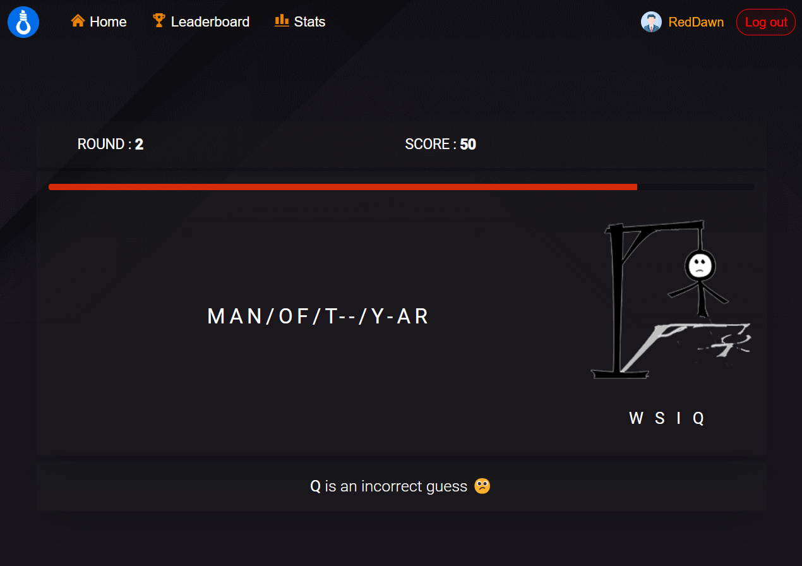
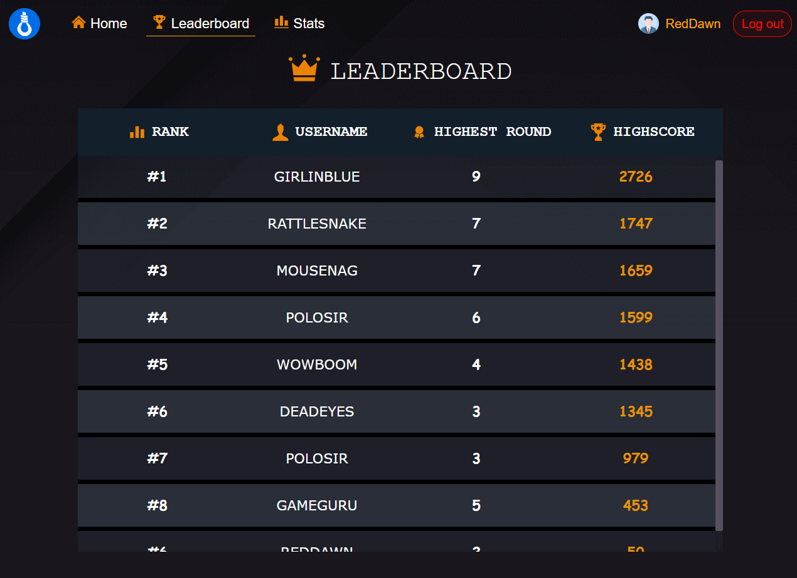
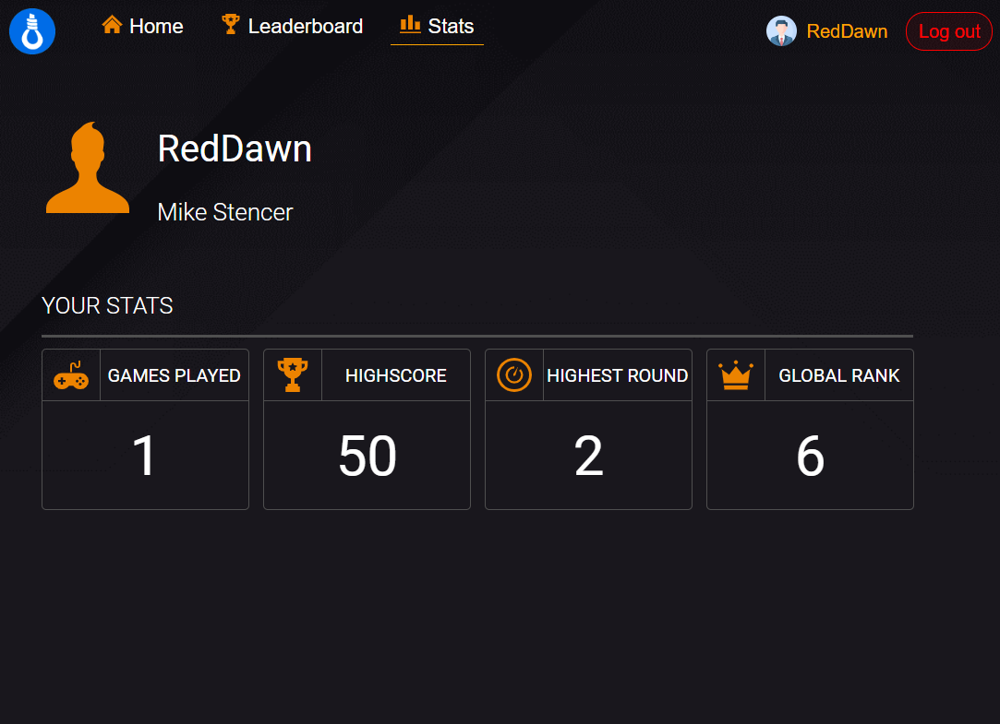

<h1 align="center">
   
  
   
  Hangman
   
</h1>

 

# Hangman🚀

- **Straightforward UI**: Our game's interface is as easy as making popcorn! No complicated menus or confusing buttons, just pure movie-guessing fun.
   
- **Leaderboard**: Ascend to the ranks of elites as you compete with other players for the coveted title of Movie Mogul. Will your movie knowledge shine brighter than a blockbuster?
   
- **stats**: Keep track of your movie-solving skills and stats. Discover your top scores, total games played, and other stats that would make even the most prestigious movie critic blush.

### contributors

## Development server

Run `ng serve` for a dev server. Navigate to `http://localhost:4200/`.
